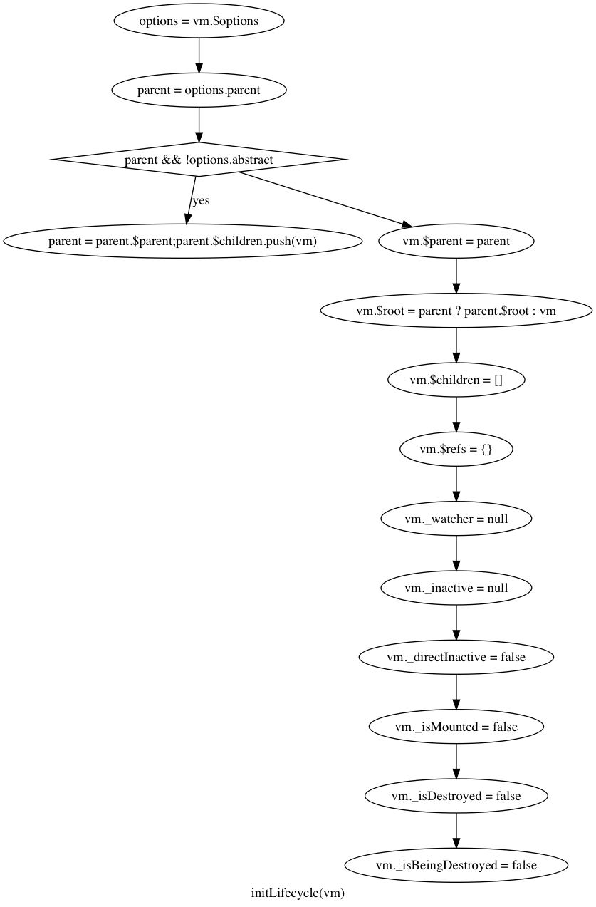
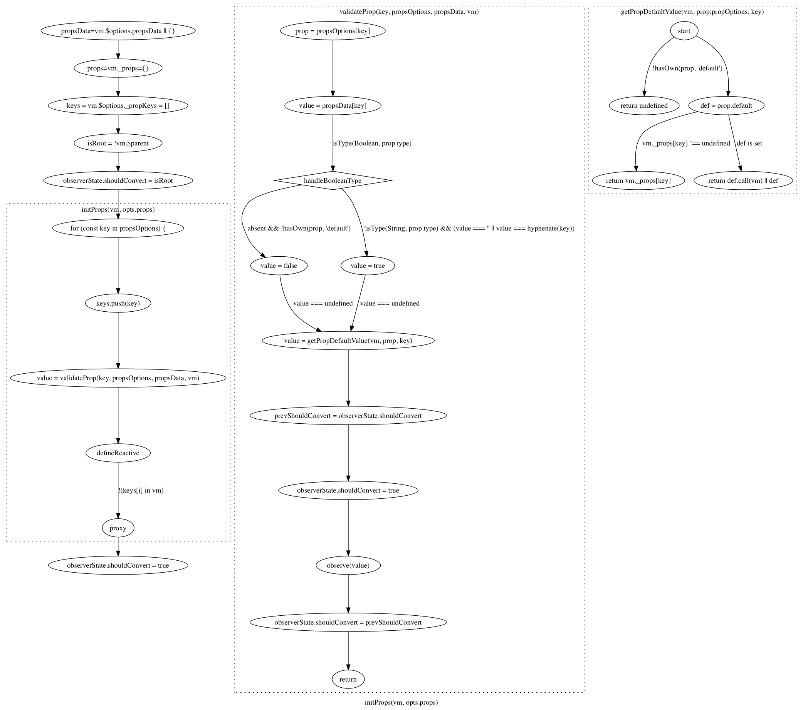
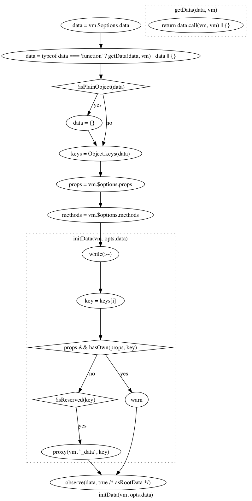
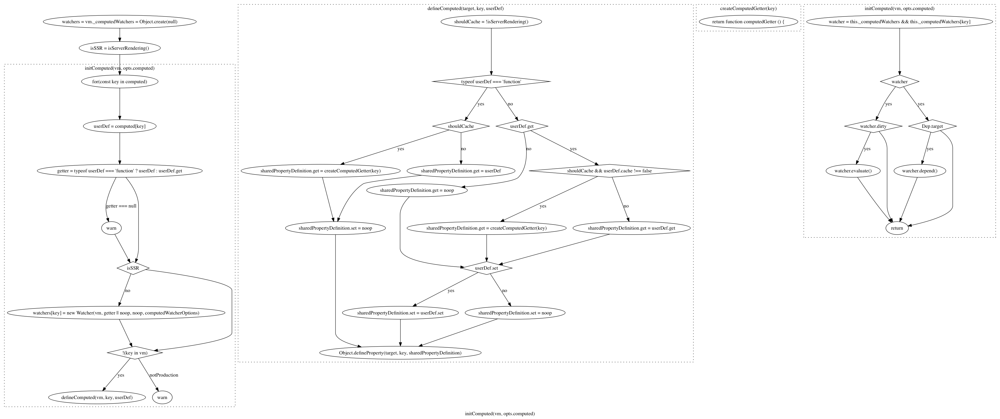
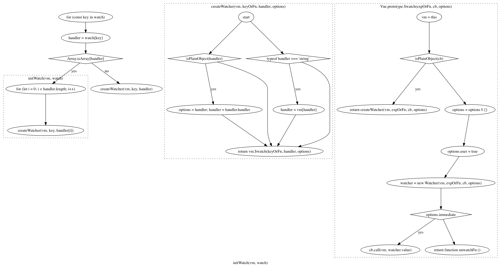

# vue 源码阅读过程

## _init

调用`this._init`发生了什么？

主要来说，就是给`vm`添加了

- _uid
- _isVue = true
- $options = options
- _self = this

以及调用了`beforeCreated`钩子和`created`钩子。


### initLifecycle

在`_init`函数内调用了`initLifecycle`函数，从名字看是初始化生命周期？实际上就是给`vm`添加了很多的属性：

- $parent = options.parent
- $root = $parent.root || vm
- $children = []
- $refs = {}
- _watcher = null
- _inactive = null
- _directInactive = false
- _isMounted = false = false
- _isDestroyed = false
- _isBeingDestroyed = false



### initEvent

顾名思义，初始化事件，主要就是将`_parentListeners`上的事件，注册到`vm`上？并将旧事件（如果有）就更新或者移除掉。

由于是使用`vm.$on`或者`vm.$once`添加事件，不过有个疑问就是为什么`vm`有这些方法，是在哪里添加的？


### initRender

额，在这个函数内，做了非常多的事情，当然，最重要的就是我们熟知的设置`set`和`get`实现响应式，虽然只是给`$attrs`和`$listeners`设置，总体来说做了下面这些事情：

- vm._vnode = null
- vm.$solts = resolveSlots()
- vm.$scopedSlots = emptyObject
- vm._c = func
- vm.$createElement = func
- vm.$attrs
- vm.$listeners


### initInjections

哦，完全不明白这个函数用来做什么，至今为止没有主动用到过`inject`这个配置项，到后面遇到的时候再回过头来看看吧。


### initState

终于到了我们最熟悉的地方，在`initState`函数内，会对`props`、`methods`、`data`、`computed`以及`watch`进行处理，对，就是我们在日常中最常用到的这些，都在`initState`函数内看到了，泪奔啊。

由于代码量太多，所以又拆开来分析。


#### initProps

初始化`props`，虽然听起来很简单，但实际上也是做了很多事情，先对`props`做验证，然后是返回值（如果传入了就用传入的，否则就用默认的）。

- vm._props = {}
- vm.$options._propKeys = []



#### initMethods

这是最简单的函数了，在开发环境会做一些错误提示，比如该方法值是`null`，或者已经是一个`props`之类的，在生产环境就直接会将该方法放到`vm`上，如果是`null`就变成一个空函数。


#### initData

其实在`initData`内并没有做什么，主要还是一些重新属性的错误提示，最主要的工作还是由`observe`来做的，在很多地方出现了这个函数，所以肯定是要独立来分析的。



#### initComputed

很复杂，虽然在看之前就已经预料到会很复杂。

主要做了两件事，1、给每个`key`实例化了一个`Watcher`并保存；2、在`vm`上添加了`computed`同名的`key`，并且在获取值时会调用之前实例化的`watcher`上的方法。

但，为什么函数体内的值发生变化的时候，会触发到自身调用呢？

- vm._computedWatchers  保存了很多个 Watcher 实例，用在获取值的时候



#### initWatch

初始化监听，很简单，遍历`watch`并给每个键调用`createWatcher`，而在`createWatcher`中其实就是调用了`vm.$watch`，而在`vm.$watch`中，其实最终还是实例化`Watcher`。



### initProvide

只是添加了`vm._provide`这一个属性。


## $mount


OK，前面终于完成了初始化，到目前为止都是平台无关的，接下来就和运行的平台有关了，所以是分为了`web`与`weex`两个不同的`$mount`实现，当然这里只会分析`web`端的实现，这部分的入口在`vue/platforms/web/entry-runtime-with-compiler.js"。

开始吧！

在这个函数内，主要是对`el`、`template`做处理，需要将这两个转换为`render`函数，当然如果已经有`render`函数，会忽略上面两个。

由于存在“编译”，所以还是很复杂，主要逻辑在`compileToFunctions`函数内。


### compile

额，先来说说`compile`，因为`compileToFunctions`是调用`createCompileToFunctionsFn`时传入`compile`得到的。


### createCompileToFunctionFn

其实就是返回了`compileToFunctions`这个函数，额外的处理就是多了`cache`闭包，能够缓存一些重复的编译工作？

重点还是`compileToFunctions`函数：

### compileToFunctions

调用了传进来的`compile`，就是上面那个函数得到了`compiled`变量，再调用`createFunction`并传入了`compile.render`就得到了`render`函数。


### baseCompile

噢，虽然知道了`options.render`函数是调用`compileToFunction`得到，而在这个函数里面实际是调用了`createFunction`并传入`compile.render`得到的，与之对应的`compiled.render`又是通过调用`compile`得到的，但最最最内部，实际还是调用的`baseCompile`对`template`解析得到一切。

而这个`baseCompile`是在调用`createCompilerCreator`函数时传入的，所以说，其实是可以定制化核心的那个编译器？

编译器做的事情看起来蛮简单的，

- 1、ast = parse(template, options)
- 2、optimize(ast, options)
- 3、code = generate(ast, options)

所以又要拆开来看了

#### parse

太复杂了。。。。就是语法分析生成`AST`那一套，可能由于还要处理自定义指令，模板等所以更复杂？

暂时还是不看了，`optimize`也是比较复杂，最后`generate`稍微简单一些。

#### generate

会根据传入的`ast`判断生成何种类型的节点，组件、原生DOM 亦或者是 if for 之类的处理？

不过最终其实只是拼接成了`_c(componentName)`这种形式，所以我们看到的每一个组件都是这样的，这里得到字符串，然后使用`new Function`得到函数，最后挂载到了`options.render`上。


## mountComponent

有趣的是，貌似是先在`runtime/index.js`里面声明了`$mount`方法，然后又在`entry-runtime-with-compiler.js`保存了一下，然后覆盖。

这就导致了，完成编译后，会调用`runtime/index.js`的`mount`方法，其实就是调用`mountComponent`方法。

- vm.$el = el
- vm._watcher = new Watcher()
- vm._isMounted = true


由于存在两个组件，所以会触发两次`mountComponent`，在第二次断点的时候，会从`new Watcher()`到`updateComponent`这个函数里面来，所以要先看看`new Watcher()`到底做了啥。

最后有这么一段代码：

```javascript
this.value = this.lazy ? undefined : this.get()
```

意思就是说，在实例化`watcher`的时候，如果不是`lazy`，就会立刻去获取值放到`watcher.value`上。而`this.get()`重点是这段：

```javascript
value = this.getter.call(vm, vm)
```

噢，又到了`this.getter`这个函数，而这个函数却是实例化`watcher`时传入的第二个参数！实际上就是我们在`mountComponent`中声明的`updateComponent`函数！

欧克欧克，终于又连起来了。

所以接下来就是调用

```javascript
vm._update(vm._render(), hydrating)
```

### vm._render

来到了core/instance/render.js 这个文件。

最核心的就是调用`render`方法，得到`vnode`，其他的就是添加了一些属性。

- vm.$vnode = _parentVnode

但是，`render`函数是由模板解析得到的，所以无法跟踪查看`render`函数到底做了什么，但是我们可以查看下`vnode`到底是什么

```javascript
vnode = VNode {
    elm: undefined,
    functionalContext: undefined,
    functionalOptions: undefined,
    functionalScopeId: undefined,
    isAsyncPlaceholder: false,
    isCloned: false,
    isComment: false,
    isOnce: false,
    isRootInsert: true,
    isStatic: false,
    key: undefined,
    ns: undefined,
    parent: undefined,
    raw: false,
    tag: "vue-component-1-app",
    text: undefined,
    child: undefined,
    asyncFactory: undefined,
    asyncMeta: undefined,
    children: undefined,
    componentInstance: undefined,
    data: {
        hook: {
            destroy: ƒ destroy(vnode),
            init: ƒ init(vnode, hydrating, parentElm, refElm),
            insert: ƒ insert(vnode),
            prepatch: ƒ prepatch(oldVnode, vnode),
        },
        on: undefined,
    },
    context: VueInstance,
    componentOptions: {
        Ctor: ƒ VueComponent(options),
        children: undefined,
        listeners: undefined,
        propsData: undefined,
        tag: "App",
    },
}
```

重点是`componentOptions`。


### vm._update

更新节点，获取旧节点与新节点，如果是初始化就在调用`patch`时传入不同的参数。如果是更新，就只传入`prevVnode`和`vnode`，如果父节点是`HOC`？就更新父节点的内容（vm.$parent.$el = vm.$el）。


还没有结束，重点在`patch`函数，该函数内会调用`createElm`，该函数又会调用`createComponent`，然后在函数内会取`vnode.data.hook.init`，然后调用这个`init`函数。


所以接下来要断点到`init`函数内看看了。

#### vnode.data.hook.init

位于`/core/vdom/create-component.js`文件内。

`init`钩子会调用`prepatch`钩子，而该钩子又调用`updateChildComponent`函数。


#### updateChildComponent

最后调用了`$forceUpdate`，而该方法只是调用了`vm._watcher.update()`方法。


虽然理论上来说，这里就能在页面上看到我们的组件了，但实际上并没有，断点回到了`Watcher.prototype.get`这个方法里面了，一直一直往上最终居然到了`createComponent`这个函数内，并且出来的点是`i(vnode, false, parentElm, refElm)`这个函数的调用。

然后再到`createElm`函数内。
