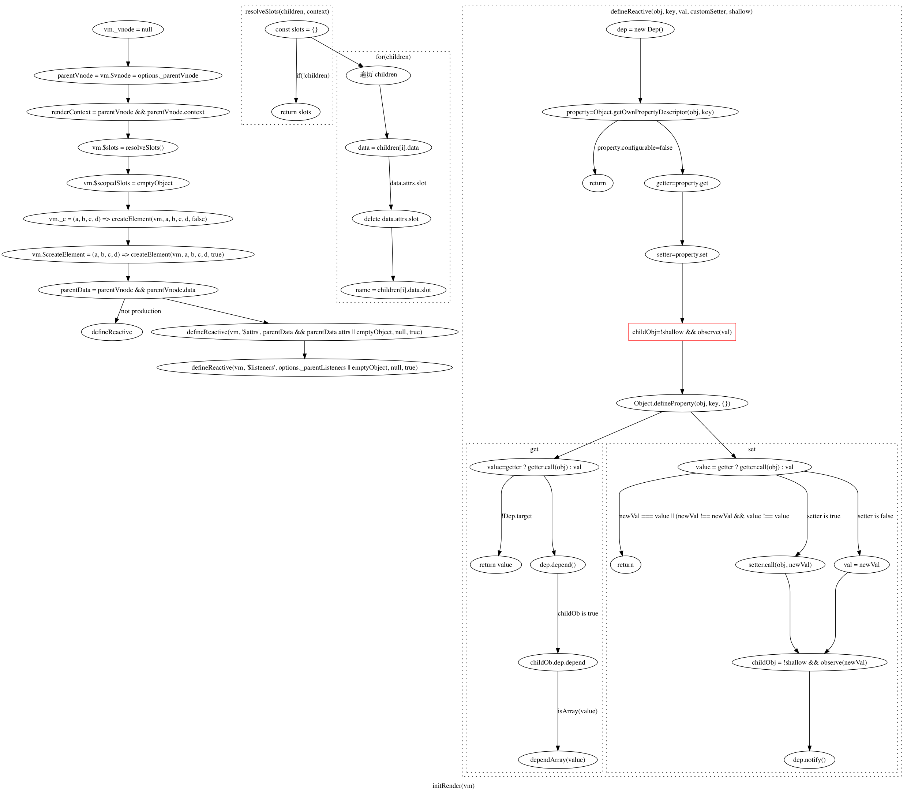
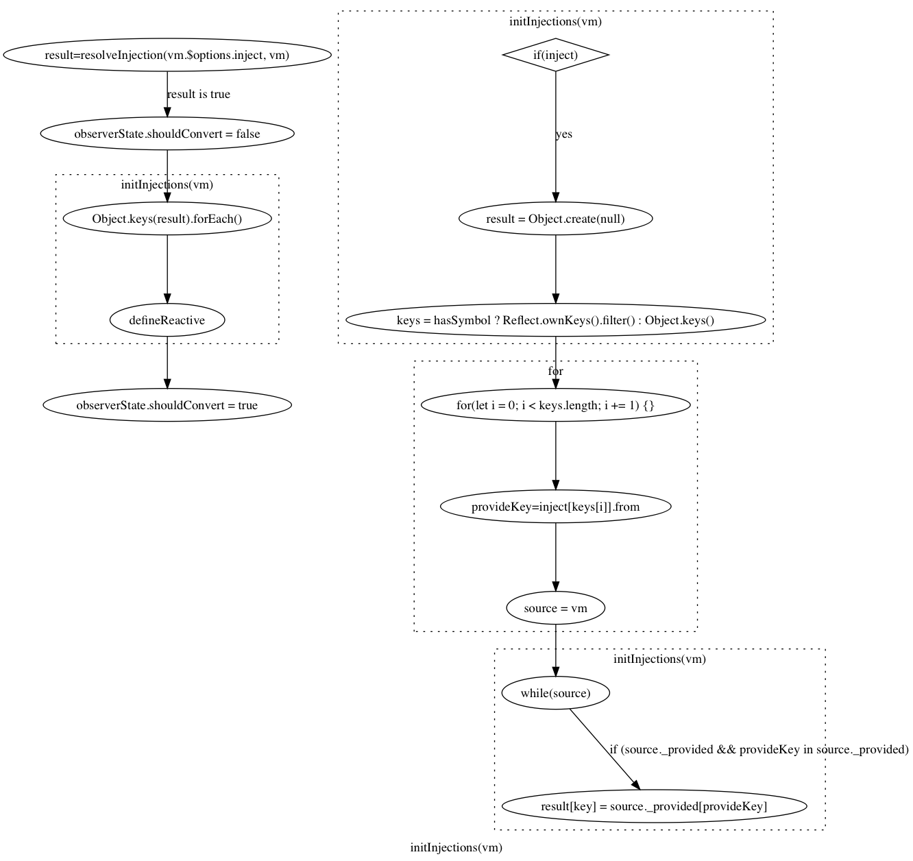
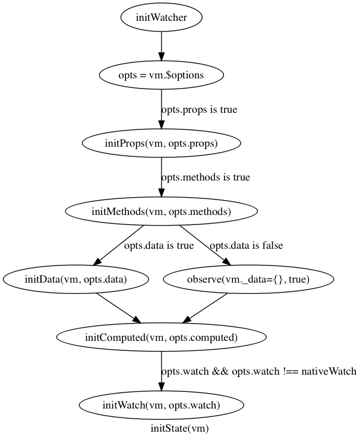
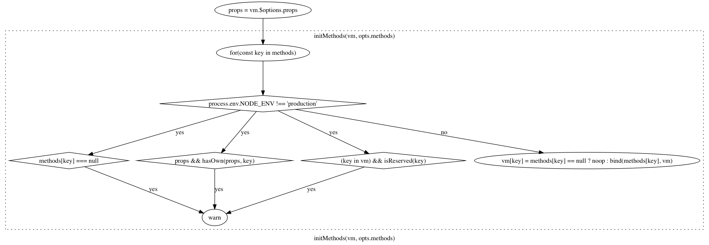

# vue 源码阅读过程

## _init

调用`this._init`发生了什么？

主要来说，就是给`vm`添加了

- _uid
- _isVue = true
- $options = options
- _self = this

以及调用了`beforeCreated`钩子和`created`钩子。

### initLifecycle

在`_init`函数内调用了`initLifecycle`函数，从名字看是初始化生命周期？实际上就是给`vm`添加了很多的属性：

- $parent = options.parent
- $root = $parent.root || vm
- $children = []
- $refs = {}
- _watcher = null
- _inactive = null
- _directInactive = false
- _isMounted = false = false
- _isDestroyed = false
- _isBeingDestroyed = false

### initEvent

顾名思义，初始化事件，主要就是将`_parentListeners`上的事件，注册到`vm`上？并将旧事件（如果有）就更新或者移除掉。

由于是使用`vm.$on`或者`vm.$once`添加事件，不过有个疑问就是为什么`vm`有这些方法，是在哪里添加的？

### initRender

额，在这个函数内，做了非常多的事情，当然，最重要的就是我们熟知的设置`set`和`get`实现响应式，虽然只是给`$attrs`和`$listeners`设置，总体来说做了下面这些事情：

- vm._vnode = null
- vm.$solts = resolveSlots()
- vm.$scopedSlots = emptyObject
- vm._c = func
- vm.$createElement = func
- vm.$attrs
- vm.$listeners

### initInjections

哦，完全不明白这个函数用来做什么，至今为止没有主动用到过`inject`这个配置项，到后面遇到的时候再回过头来看看吧。

### initState

终于到了我们最熟悉的地方，在`initState`函数内，会对`props`、`methods`、`data`、`computed`以及`watch`进行处理，对，就是我们在日常中最常用到的这些，都在`initState`函数内看到了，泪奔啊。

由于代码量太多，所以又拆开来分析。

#### initProps

初始化`props`，虽然听起来很简单，但实际上也是做了很多事情，先对`props`做验证，然后是返回值（如果传入了就用传入的，否则就用默认的）。

- vm._props = {}
- vm.$options._propKeys = []

#### initMethods

这是最简单的函数了，在开发环境会做一些错误提示，比如该方法值是`null`，或者已经是一个`props`之类的，在生产环境就直接会将该方法放到`vm`上，如果是`null`就变成一个空函数。

